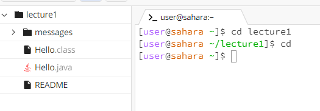

# Lab Report 1
## 1. Examples without arguments
### cd
  
The working directory was in **~/lecture1**. I got that output because **cd** without an argument will take me to the home directory. **~** indicates that I am now in the home directory, so the output is not an error.  
### ls
 
The working directory was in **~/lecture1**. I got that output because **ls** without an argument will output the contents of the working directory. It outputted Hello.class, Hello.java, messages, and README. Since those are the contents of **lecture1**, the output is not an error.  
### cat
  
The working directory was in **~/lecture1**. The output was blank because **cat** without an argument will wait for me to type an input to echo until I press crtrl+d. The output is not an error.  

## 2. Examples with a path to a directory as an argument
### cd
  
The working directory was in **/home**. I got that output because **cd** switches the current working directory to the directory path of the argument. Since that directory path became the new working directory, the output is not an error. 
### ls
  
The working directory was in **/home**. I got that ouput because **ls** prints all the contents of the directory path of the argument. The output is not an error.
### cat
  
The working directory was in **/home**. I got that output because the argument for **cat** should be a path to a file. The output is an error because it tells me that the argument I gave is a directory when it is supposed to print out the contents of one or more files.  

## 3. Examples with a path to a file as an argument
### cd
  
The working directory was in **/home**. I got that output because the argument for **cd** should be a path to a directory. The output is an error because it tells me that the argument I gave is not a directory when it is supposed to change the working directory to the path given in the argument.
### ls
  
The working directory was in **/home**. I got that output because **ls** outputs the path of a file if its argument is a path to a file. The output is not an error.
### cat
  
The working directory was in **/home**. I got that output because **cat** prints the contents of a given file path. Since the argument was a path to the file Hello.java, it outputted the contents of it, so the output is not an error.
