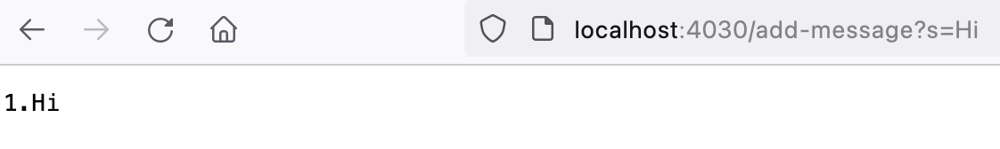
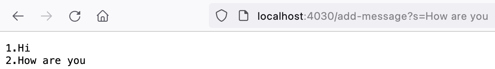
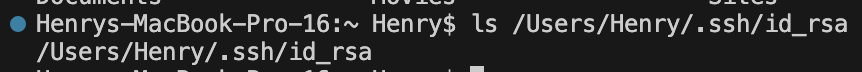
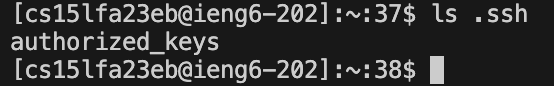
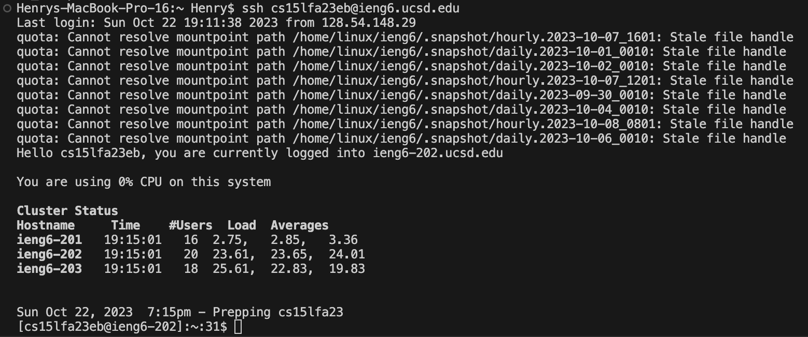

# Lab Report 2 - Servers and SSH Keys
## Part 1
```java
import java.io.IOException;
import java.net.URI;
import java.util.ArrayList;

class Handler implements URLHandler {
    ArrayList<String> messages = new ArrayList<String>();

    public String handleRequest(URI url) {
        if (url.getPath().equals("/")) {
            return formatMessageList(messages);
        } else {
            if (url.getPath().contains("/add-message")) {
                String[] parameters = url.getQuery().split("=");
                if (parameters[0].equals("s")) {
                    messages.add(parameters[1]);
                    return formatMessageList(messages);
                }
            }
            return "404 Not Found!";
        }
    }
    public String formatMessageList (ArrayList<String> arrayList) {
        String result = "";
        for(int i = 0; i < arrayList.size(); i++) 
            result += (i+1) + "." + arrayList.get(i) + "\n";    
        return result;
    }    
}

class StringServer {
    public static void main(String[] args) throws IOException {
        if(args.length == 0){
            System.out.println("Missing port number! Try any number between 1024 to 49151");
            return;
        }

        int port = Integer.parseInt(args[0]);

        Server.start(port, new Handler());
    }
}
```
**Using /add-message**  
  
- When I used `/add-message?s=Hi`, the methods `handleRequest` and `formatMessageList` were called.  
- The relevant argument for `handleRequest` is `URI url`, which would be `http://localhost:4030/add-message?s=Hi`, and the relevant values in it are `add-message`, `s`, and `Hi`. The relevant argument for `formatMessageList` an arrayList of strings, which would be the ArrayList `messages` that stores all of the messages, and the relevant value for it would be `Hi`.  
- This specific request changes the `messages` ArrayList because it adds `Hi` to it, and then `messages` is formatted by `formatMessageList` so that the messages will be listed. The request also changes the value in `parameters[1]` because `Hi` from url query is stored there.  


**Using /add-message again**  
  
- When I used `/add-message?s=How are you`, the methods `handleRequest` and `formatMessageList` were called.  
- The relevant argument for `handleRequest` is `URI url`, which would be `http://localhost:4030/add-message?s=How are you`, and the relevant values in it are `add-message`, `s`, and `How are you`. The relevant argument for `formatMessageList` an arrayList of strings, which would be the ArrayList `messages` that stores all of the messages, and the relevant value for it would be `How are you`.
- This specific request changes the `messages` ArrayList because it adds `How are you` to it, and then `messages` is formatted by `formatMessageList` so that the messages will be listed. The request also changes the value in `parameters[1]` because `How are you` from the url query is stored there.
  
## Part 2  
- Path to my private key  
    
- Path to my public key  
   
- Login without password
   
## Part 3  

