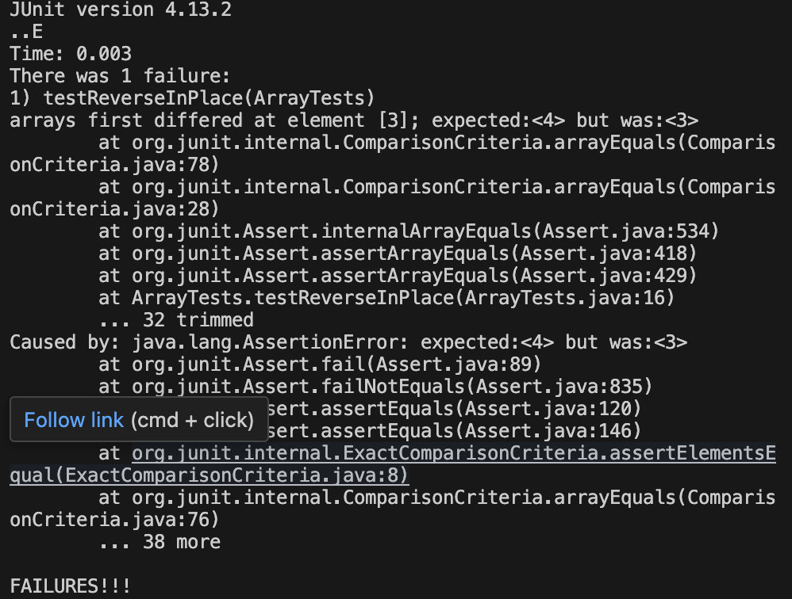
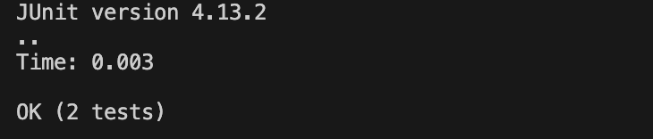

# Lab Report 3 - Bugs and Commands  
## Part 1 - Bugs  
I chose to test the method reverseInPlace().  

```java
@Test
public void testReverseInPlace1() {
  int[] input = { 4 };
  ArrayExamples.reverseInPlace(input);
  assertArrayEquals(new int[]{ 4 }, input);
}

@Test 
public void testReverseInPlace2() {
  int[] input = { 6,5,4,3,2,1 };
  ArrayExamples.reverseInPlace(input);
  assertArrayEquals(new int[]{ 1,2,3,4,5,6 }, input);
}
```   
The JUnit test `testReverseInPlace2` outputs a failure with the input `{ 6,5,4,3,2,1 }`.  
The input `{ 4 }` in `testReverseInPlace1` however doesn't induce a failure.  

  

The code that induces a failure for a test:  
```java
static void reverseInPlace(int[] arr) {
  for(int i = 0; i < arr.length; i += 1) {
    arr[i] = arr[arr.length - i - 1];
  }
}
```
The fixed code that doesn't induce a failure:  
```java
static void reverseInPlace(int[] arr) {
  int temp = 0;
  for(int i = 0; i < arr.length/2; i += 1) {
    temp = arr[i];
    arr[i] = arr[arr.length - i - 1];
    arr[arr.length - i - 1] = temp;
  }
}
```
  

In the old code, `arr[i]` wasn't stored for safekeeping, so `arr[arr.length - i - 1]` remained the same when it should have the old value of `arr[i]`. Adding the variable `int temp` and adding `arr[arr.length - i - 1] = temp;` at the end of the loop addresses this issue since `arr[arr.length - i - 1]` will have the correct value. Since the code looks at two elements with each iteration of the for loop, the index will go out of bounds, so setting the for loop condition as `i < arr.length/2` addresses this issue.  

## Part 2 - Researching Commands   
I choose the look at four alternate command-line options of the command `less`. I used the information outputted from `man less` as reference.  

One interesting command line option is `-p pattern`, which tells `less` to start at the first occurence of `pattern` in the file we want to look at. 

`$less -p "What If?" technical/911report/chapter-1.txt`

```
What If?

    NORAD officials have maintained consistently that had the passengers not caused United 93 to crash, the military would have prevented it from reaching Washington, D.C. That conclusion is based on a version of events that we now know is incorrect. The Langley fighters were not scrambled in response to United 93; NORAD did not have 47 minutes to intercept the flight; NORAD did not even know the plane was hijacked until after it had crashed. It is appropriate, therefore, to reconsider whether United 93 would have been intercepted.

    Had it not crashed in Pennsylvania at 10:03, we estimate that United 93 could not have reached Washington any earlier than 10:13, and probably would have arrived before 10:23. There was only one set of fighters circling Washington during that time frame-the Langley F-16s. They were armed and under NORAD's control. After NEADS learned of the hijacking at 10:07, NORAD would have had from 6 to 16 minutes to locate the flight, receive authorization to shoot it down, and communicate the order to the pilots, who (in the same span) would have had to authenticate the order, intercept the flight, and execute the order.

    At that point in time, the Langley pilots did not know the threat they were facing, did not know where United 93 was located, and did not have shootdown authorization.

    First, the Langley pilots were never briefed about the reason they were scrambled. As the lead pilot explained, "I reverted to the Russian threat. . . . I'm thinking cruise missile threat from the sea. You know you look down and see the Pentagon burning and I thought the bastards snuck one by us. . . . [Y]ou couldn't see any airplanes, and no one told us anything." The pilots knew their mission was to divert aircraft, but did not know that the threat came from hijacked airliners.

    Second, NEADS did not have accurate information on the location of United 93. Presumably FAA would have provided such information, but we do not know how long that would have taken, nor how long it would have taken NEADS to locate the target.
```
