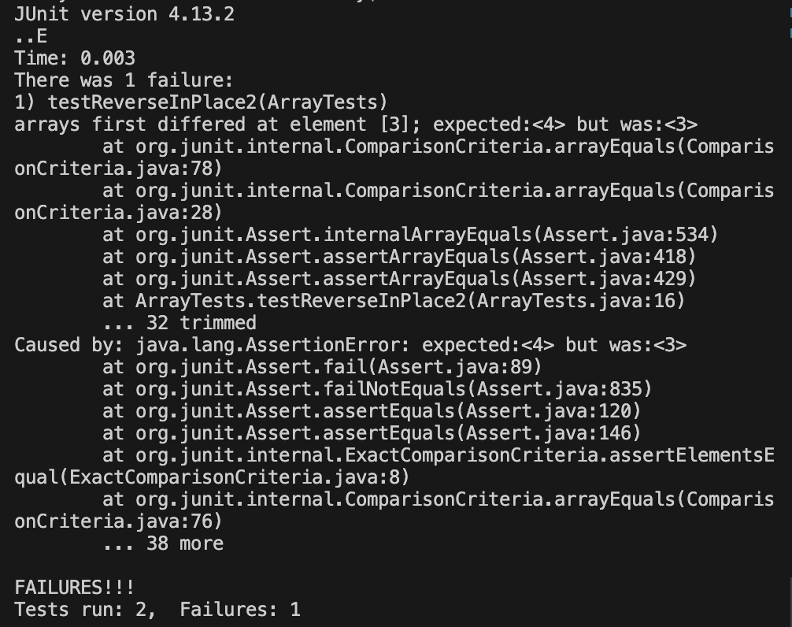

# Lab Report 3 - Bugs and Commands  
## Part 1 - Bugs  
I chose to test the method reverseInPlace().  

```java
@Test
public void testReverseInPlace1() {
  int[] input = { 4 };
  ArrayExamples.reverseInPlace(input);
  assertArrayEquals(new int[]{ 4 }, input);
}

@Test 
public void testReverseInPlace2() {
  int[] input = { 6,5,4,3,2,1 };
  ArrayExamples.reverseInPlace(input);
  assertArrayEquals(new int[]{ 1,2,3,4,5,6 }, input);
}
```   
The JUnit test `testReverseInPlace2` outputs a failure with the input `{ 6,5,4,3,2,1 }`.  
The input `{ 4 }` in `testReverseInPlace1` however doesn't induce a failure.  

  

The code that induces a failure for a test:  
```java
static void reverseInPlace(int[] arr) {
  for(int i = 0; i < arr.length; i += 1) {
    arr[i] = arr[arr.length - i - 1];
  }
}
```
The fixed code that doesn't induce a failure:  
```java
static void reverseInPlace(int[] arr) {
  int temp = 0;
  for(int i = 0; i < arr.length/2; i += 1) {
    temp = arr[i];
    arr[i] = arr[arr.length - i - 1];
    arr[arr.length - i - 1] = temp;
  }
}
```
  

In the old code, `arr[i]` wasn't stored for safekeeping, so `arr[arr.length - i - 1]` remained the same when it should have the old value of `arr[i]`. Adding the variable `int temp` and adding `arr[arr.length - i - 1] = temp;` at the end of the loop addresses this issue since `arr[arr.length - i - 1]` will have the correct value. Since the code looks at two elements with each iteration of the for loop, the index will go out of bounds, so setting the for loop condition as `i < arr.length/2` addresses this issue.  

## Part 2 - Researching Commands   

