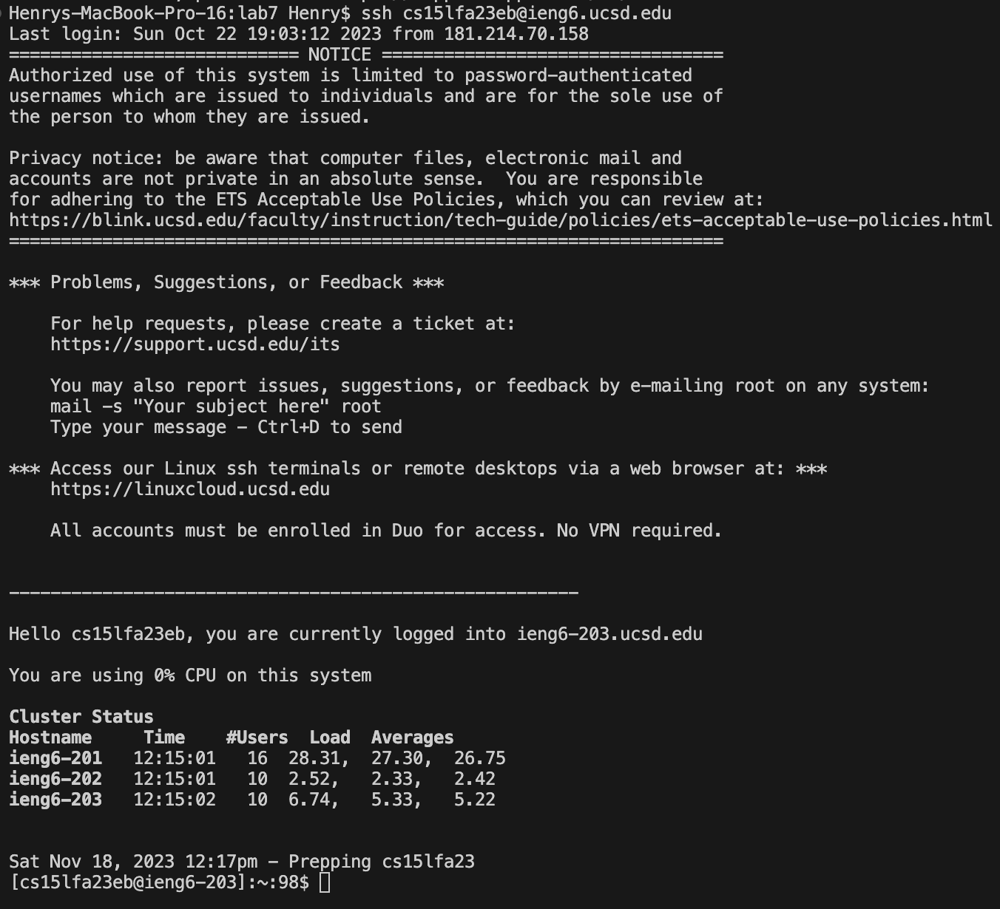
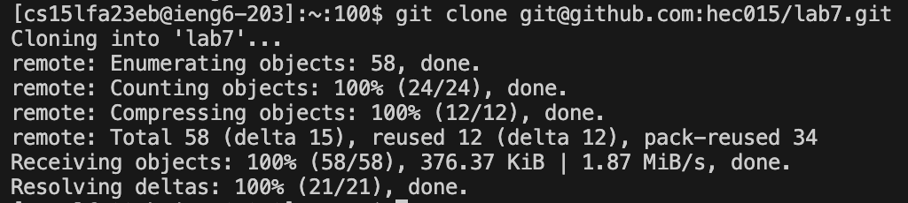
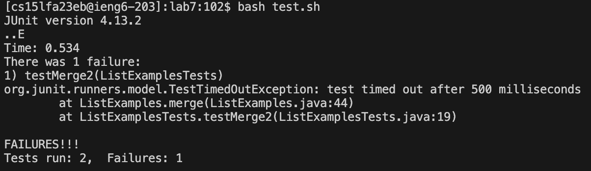
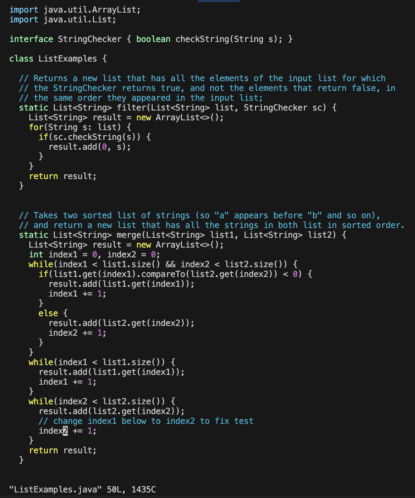
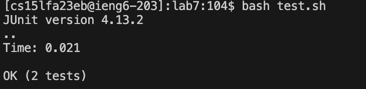
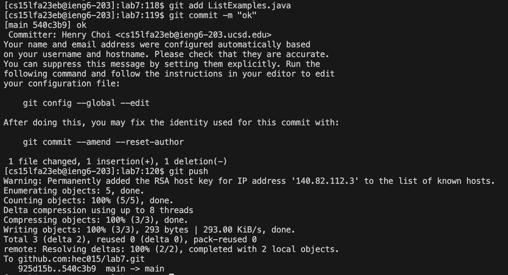

# Lab Report 4 - Vim
## Log into ieng6  
I pressed the arrow up key `<up>` to get `ssh cs15lfa23eb@ieng6.ucsd.edu`, and then pressed `<enter>`. 
That command, which lets me log into ineng6, was one up my command history, so I was able to go back to it by pressing `<up>` once.  

 

## Clone your fork of the repository from your Github account (using the SSH URL)
I typed `git clone ` and then pressed `<command>` and `v` to paste the SSH URL of my fork of lab7, and then I pressed `<enter>` to clone my fork onto ieng6.   

 

## Run the tests, demonstrating that they fail  
I typed `cd lab7`, and pressed `<enter>`. Then I typed `bash t`, pressed `<tab>` to autocomplete it to `bash test.sh`, and then pressed `<enter>` to run the test.    
`<tab>` lets me type faster by making the shell complete what I want to type.  

## Edit the code file to fix the failing test   
I typed `vim L`, pressed `<tab>`, then pressed `.`, then pressed <tab> again to autocomplete it to `vim ListExamples.java`, and then pressed `<enter>`. 
I then pressed `G, 6, k, e, x, i, 2, <esc>, :, w, q`, and <enter>`. 

In Vim, `G` lets me jump to the last line, and `6` and `k` lets me go up 6 six lines to the line where I need to make the edit.  
`e` goes to the end of the word, "index1", and `x` deletes the "1".   
I press `i` to enter insert mode, and pressed `2` so I can change it to "index2", pressing `<esc>` after to exit insert mode.  
`:wq` then saves the edit and exits Vim.  

  

## Run the tests, demonstrating that they now succeed   
I pressed `<up><up><enter>` to run the tests. `bash test.sh` was two up my command history, which is why I was able to use `<up><up>`.

## Commit and push the resulting change to your Github account  
I typed `git add L`, pressed `<tab>` to get `git add ListExamples.java`, and pressed `<enter>` to prepare my edit for a commit.
Then I typed `git com`, pressed `<tab>` to get `git commit`, and typed `-m "ok"` to get `git commit -m "ok"`, and then I pressed `<enter>` to commit the edit.  
I then typed `git push` to push the resulting change to my Github account.  

