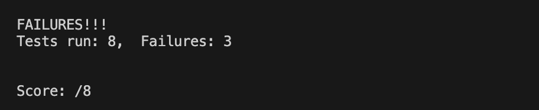
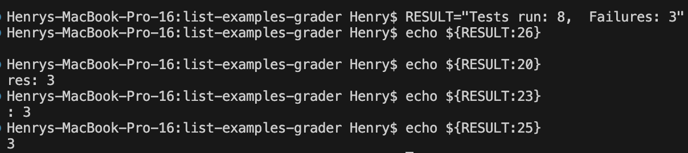
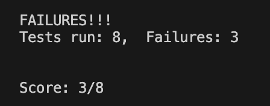

# Lab Report 5 – Putting it All Together   

## EdStem Post: 
### Week 6 lab grading script not showing score  
When I run `bash test.sh https://github.com/...`, I have trouble with getting it to show the score of student submissions that are able to compile but don't pass every test.   

I have it so that the output of JUnit on `TestListExamples` is redirected to `junit-output.txt` in `grading-area`. I then use `grep "Tests run:" junit-output.txt` to get the line in JUnit that has the number of failures and store it in the variable `RESULT_LINE`. Then, I use `${RESULT_LINE:26}` to get the number of failures from the line and store that in the variable `COUNT`. 

`"Score: $COUNT/8"` should print the score, but it doesn't print the value of `COUNT`.  

I think the bug has something to do with `${RESULT_LINE:26}`. This line should extract the number of failures from the last index of the string, which is 26, but it doesn't.  

  

### TA Response  
`${parameter:offset:length}` will get a substring up to *length* characters starting at the index *offset*. Since the number of failures is the last string, omitting *length* will still work.  

I suggest you try using `echo` on different indices.  

### Student Reply  
Thank you! I did as you suggested and found that the index containing the number of failures was not 26 as I had thought, but it was 25. It appears that counted the indices starting at 1 instead of 0. Changing the line to `COUNT=${RESULT_LINE:26}` fixed the bug, and now the grading script correctly displays the score.  

  
  

## Reflection  
Something I learned from my lab experience in the second half of this quarter that I didn't know before was learning about jdb. Before, I would just scan my code line by line trying to find where the bug might be, so learning about jdb has been very useful as it can greatly speed up the debugging process. The most recent example of its usefulness was when I was stuck on one of the quiz problems for a while, but when I remembered jdb and then used it, I was able to figure out the answer and also understand it–I thought that was really cool.

